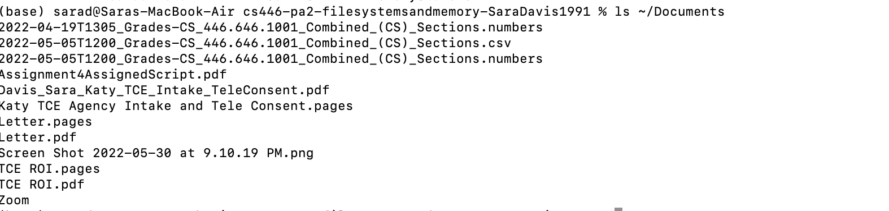

# Linux File Systems and Memory

[](https://classroom.github.com/online_ide?assignment_repo_id=8016507&assignment_repo_type=AssignmentRepo)
**<p align = "center"> CS446-Summer22-PA2</p>**

**Learning Outcomes**

1. You will use C to implement your own version of the ls and ls -l Linux commands
2. You will practice Linux file sytem navigation 
3. You will use C to implement your own version of the linux _free_ command 
4. You will practice reading technical documentation in C on linux
5. You will implement C code that enacts Linux specific system calls

**General Instructions and Hints**: 

-Name files exactly as described in the documentation below.<br/> 
-You have been provided the executables _file\_system\_info_ and _Memory\_Stats_. Use them to test the described cases, and to properly format your output. **Points will be taken off for output that is not fairly similar to the output in the executables.**<br/> 
-The autograder is available to you. Because the output from many of this assignment's system calls is randomized by the github, there are not tests for most of the described scenarios. **Base your functionality off of the executables, not the tests**. <br/> 
-If you get a permission denied error when you try to run the executables, use _chmod u+x <executableName>_.<br/>
-When parts 1 and 2 are done, open a terminal and cd to your github repo, wherever you saved it. Do the following: _git add ._ then _git commit -m <whatevermessageyouwant>_ then _git push_. **Only submit the requested code, your README.md, and the two provided executables.**<br/>
-All work should be done on a machine where you have sudoer permission. <br/>
-All work should be your own, and should be written in the C programming language. <br/>
-In cases where the assignment tells you to use a specific system call, **you must use that system call to receive credit**<br/>
-If you are confused about how a system call works in C, **do some research!**. The internet has so many resources, and you should become used to searching for relevant information!<br/>


**<p align = "center"> Part 1, File Systems </p>**
 **Background** <br/>
The Linux operating system (and most Unix based systems) allows you to use the _ls_ command to show the contents of a directory. In Linux, the _ls_ binary is downloaded when the operating system is installed, and saved to _/usr/bin/ls_. Anytime you type ls into the terminal (with or without arguments), this executable is run. In our last assignment, we looked at the process API involved in getting Linux to run a command like _ls_, so we should already know that most processes in linux must _fork_, _execvp_, and _wait_. With that in mind, we're going to use a variety of Linux system calls in C to write our own modified _ls_ code. You can find the ls calls we're approximating in the images below.<br/>
 <br/>**<p align = "center">linux ls</p>**</br>
 <br/>**<p align = "center"> linux ls -l</p>**</br>
<br/> **<p align = "center">linux ls </p><path>**</br>
<br/>**<p align = "center"> linux ls -l <path></p>**</br>


**General Directions** <br/>
Name your program _fileSystemInfo.c_. You will turn in just the C code. **Failure to complete this portion in the C programming language will result in a 0**. In this part of the assignment, you will write **at least** two functions (and they must function in the manner described; additional helper functions are fine so long as they don't implement any additional system calls), in addition to main: one called _ls\_sim_ and one called _ls\_sim\_verbose()_ in the **C language**. Main() will parse your command line arguments (such as _ls_), and check your input using appropriate logic, and make calls to the two mandatory functions.

The purpose of this portion of the assignment is to show you what C synonymous system calls are being made from the _usr/bin/ls_ executable when you run ls from your terminal.

In other words, I'm asking you to write a very stripped down version of the ls binary.  <br/>

You may **only** use the following libraries: <br/>
 ```
<stdio.h>
<stdlib.h>
<string.h>
<sys/types.h>
<dirent.h>
<sys/stat.h>
<unistd.h>
```

You can run the executable for this portion by doing _./file\_system\_info ls_, _./file\_system\_info_, _./file\_system\_info ls -l_, _./file\_system\_info ls \<path\>_, _./file\_system\_info ls -l \<path\>_ (see below)
<br/> **<p align = "center">executable using ls </p>**</br>
 <br/> **<p align = "center">executable using no cla</p>**</br>
 <br/>**<p align = "center"> executable using ls -l</p>**</br>
<br/>**<p align = "center">executable using ls <path></p>** </br>
<br/>**<p align = "center">executable using ls -l <path> </p>**</br>

_main_ <br/>
**Input Parameters**: int argc, char* argv[] (description of command line arguments can be found [here]( https://www.tutorialspoint.com/cprogramming/c_command_line_arguments.htm)) <br/>
**Returned Output**: int <br/>
**Functionality**:  main should check that you've entered _ls_ (with or without the -l and/or path arguments) using the [strcmp](https://www.programiz.com/c-programming/library-function/string.h/strcmp) function from the string library. If ls is not entered, the appropriate error should be generated (see executable). If the user supplies a path with their ls command (_ls ~/Desktop_ or _ls -l ~/Desktop_, for example), that filepath should be checked. If the path cannot be opened using the [opendir system call](https://man7.org/linux/man-pages/man3/opendir.3.html) (check for null) then the appropriate error message should be displayed (see executable). If the user does not supply a path, you can assume that the path is the current working directory. If the path exists (it should always exist if using the current working directory), use the [_readdir()_](https://man7.org/linux/man-pages/man3/readdir.3.html) call to open a directory pointer to pass to both of the ls functions using the supplied or defaulted path (current working directory). You will need to make this call repeatedly in a loop until the pointer is null (much like your FILE* from CS135) so that every file in the appropriate directory is printed. If the user supplies the _-l_ argument with ls, _ls\_sim\_verbose_ should be called and passed the directory pointer. Otherwise, _ls\_sim_ should be called and passed the directory pointer. Any error printing should result in main immediately returning 1. If the ls functions execute successfully, return 0. <br/>

 <br/>Note: this function does need to worry about checking number of arguments (argc) to error output, in addition to making sure the ls is entered in one of the four following ways: <br/> 
 _ls_<br/>
 _ls -l_<br/>
 _ls \<pathName\>_<br/>
 _ls -l \<pathName\>_<br/>
 

_ls\_sim()_<br/>
**Input Parameters**: struct dirent* <br/>
**Returned Output**: int <br/>
**Functionality**: This function uses the passed struct dirent* parameter to print _just_ the file name using the [_d\_name_](https://pubs.opengroup.org/onlinepubs/7908799/xsh/readdir.html) property, and return 0 if successful. Otherwise return 1. <br/>

_ls\_sim\_verbose()_<br/>
**Input Parameters**: struct dirent* <br/>
**Returned Output**: int <br/>
**Functionality**: This function uses the supplied struct dirent* parameter to print the file name, file permissions (Mode), Inode information, size, and number of links. This is accomplished by creating a character buffer (char buffer[100]) and a [_struct stat_](https://man7.org/linux/man-pages/man2/lstat.2.html) object. Use the [_strcpy_](https://www.tutorialspoint.com/c_standard_library/c_function_strcpy.htm) function from the string library to copy _./_ into the buffer, followed by the dirent* d_name. Use the [_stat_](https://man7.org/linux/man-pages/man2/lstat.2.html) system call to check if the file can be found. If it can't, print the appropriate error. If it can, use the passed struct dirent* parameter to print the file name, and the _struct stat_ to print: file permissions (Mode), Inode information, size, and number of links.<br/> 
To print the name, use [_d\_name_](https://pubs.opengroup.org/onlinepubs/7908799/xsh/readdir.html).<br/>
To print the permissions (AKA mode), use [mode_t mode](https://jameshfisher.com/2017/02/24/what-is-mode_t/). Note that with this property you will need to use bitwise manipulation to translate from bits to R, W, or X. If it is not R, W, or X, the bit should be reported as - . You may use the method shown in the supplied link to translate (which uses the [conditional ternary operator](https://www.tutorialspoint.com/cprogramming/c_operators.htm)) to return r, w, x, or - , or you may devise your own solution to translating bits to chars. You will definitely want to xor each bit with the appropriate s property. For example, *((S_ISDIR(mode)) should return d if a file is a directory, while doing (mode & S_IRUSR) should return r if the user has permsion to read the file.  <br/>
To print Inode information, use the st_ino property from the [_struct stat_](https://man7.org/linux/man-pages/man2/lstat.2.html) object. <br/>
To print file size, use the st_size property from the [_struct stat_](https://man7.org/linux/man-pages/man2/lstat.2.html) object. <br/>
To print the number of links associated with the file, use the st_nlink property from the [_struct stat_](https://man7.org/linux/man-pages/man2/lstat.2.html) object. <br/>

If the stat call is successful (and prints), return 0. Otherwise return 1. <br/>

Hint: stat returns -1 if it wasn't successful. <br/>

 
 
 
 **<p align = "center"> Part 2, System Memory Stats</p>**<br/>
**Background**

The _free_ Linux system call reports various statistics about the mounted file system using the _/usr/bin/free_ binary (see below). Anytime you type free into the terminal (with or without arguments), this executable is run. In our last assignment, we looked at the process API involved in getting Linux to run a command like _ls_, so we should already know that most processes in Linux must _fork_, _execvp_, and _wait_. With that in mind, we're going to use a variety of Linux system calls in C to write our own modified _free_ code. <br/>

<br/>**<p align = "center">linux free</p>**</br>


 **General Directions** <br/>
Name your program _memoryStats_.c_. You will turn in just the C code. **Failure to complete this portion in the C programming language will result in a 0**. In this part of the assignment, you only need to write a main function. Additional helper functions are fine so long as they don't implement any additional system calls. 

The purpose of this portion of the assignment is to show you what C synonymous system calls are being made from the _usr/bin/free_ executable when you run free from your terminal.

In other words, I'm asking you to write a very stripped down version of the free binary.  <br/>

You may **only** use the following libraries: <br/>
 ```
<unistd.h>
<stdio.h>
<sys/statvfs.h>
```

You can run the executable for this portion by doing _./Memory_Stats_

_main_ <br/>
**Input Parameters**: None <br/>
**Returned Output**: int <br/>
**Functionality**: Use the [sysconf system call](https://man7.org/linux/man-pages/man3/sysconf.3.html) to get the number of physical pages (_SC_PHYS_PAGES), and the page size (_SC_PAGE_SIZE). Convert the page size to Kilobytes, and report it in KB. Calculate the total page memory by calculating the product of the number of physical pages and the page size. Convert total page memory to Gigabytes. Output the system RAM information table (see exectuable). <br/> Create a [struct statvfs object](https://man7.org/linux/man-pages/man3/statvfs.3.html), and then use the [statvfs system call](https://man7.org/linux/man-pages/man3/statvfs.3.html) to fill it. Use the object to access the appropriate properties to print free blocks (_f\_bfree_), free mounted file system space (_f\_bfree_ - _f\_bsize_) in gigabytes, and the number of free inodes (_f\_ffree_).
 
 **To Submit**<br/>
 When you are done, you should use git to git push the following to your assignment repo (see instructions above):
 1) _fileSystemInfo.c_
 2) _memoryStats.c_ 

You can submit as many times as you would like, and you can check whether your code is functioning correctly using the autograder.


