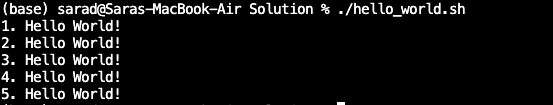
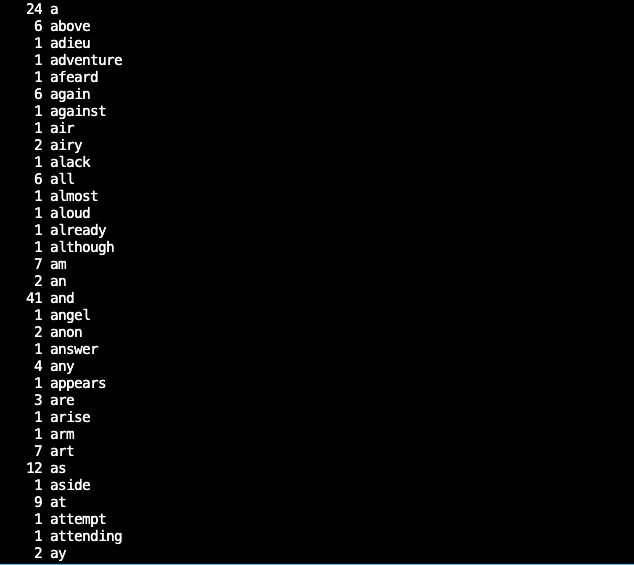
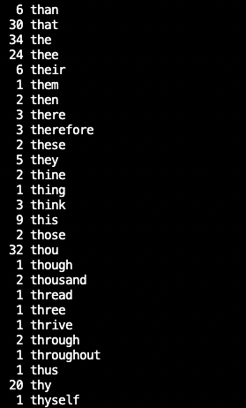
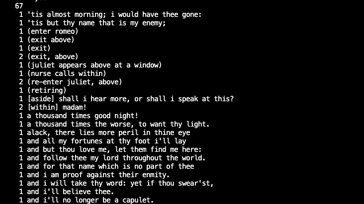

# Linux Operating System Commands
**<p align = "center"> CS446-Summer22-PA4</p>**

**Learning Outcomes**

1. You will be introduced to Linux bash scripting
2. You will become familiar with a variety of useful Linux commands


**General Instructions and Hints**: 

-Name files exactly as described in the documentation below.<br/> 
-If your code does not run, you will receive a 0.**<br/> 
-The autograder is available to you. <br/> 
-When parts 1 and 2 are done, open a terminal and cd to your github repo, wherever you saved it. Do the following: _git add ._ then _git commit -m <whatevermessageyouwant>_ then _git push_. **Only submit the requested code, and your README.md**<br/>
-All work should be done on a machine where you have sudoer permission. <br/>
-All work should be your own, and should be written in the bash (.sh) language. <br/>
-In cases where the assignment tells you to use a specific system call, **you must use that system call to receive credit**<br/>
-If you are confused about how bash works, **do some research!**. The internet has so many resources, and you should become used to searching for relevant information!<br/>


**<p align = "center"> Part 1, Bash Script Intro </p>**
 **Background** <br/>
Whenever you type a command, like _ls_, into the terminal, you are using Bash. Bash is the Unix command line interface that allows you to interact with the operating system. Any command that works in the terminal also works in a Bash script, you simply place groups of commands into a file with a .sh extension (rather than .c or .cpp or .py). Bash scripting is extremely useful when you need to perform repetitive tasks that interact with the operating system in some sort of custom order. So for example, instead of opening a terminal, typing mkdir example, hitting enter, typing cp example.txt ./example/example.txt, hitting enter to copy example.txt into the example directory, we can synthesize those commands into a single bash script. An example bash script that does this has been provided, and is called _exampleSh.sh_. Try running it by doing ./exampleSh.sh and if you get a permission denied error, use _chmod u+x_ to give yourself executable permission.<br/>

<br/>**<p align = "center">Bash script shebang. Every bash script must start with a shebang that tells the OS where to look for the bash interpreter's location (usually in /bin/bash)</p>**</br>


You will notice that the example script contains a shebang (see image above), and a for loop. That shebang tells the OS where to look for the bash interpreter's location. Usually, Unix systems store it in /bin/bash. While the syntax for the for loop is slightly different, it performs in the exact way a for loop in any other language would perform. Bash also has the ability to create [while loops, and until loops](https://ryanstutorials.net/bash-scripting-tutorial/bash-loops.php). When you are first learning to write a bash script, it can feel overwhelming because bash can be very finicky. Be sure that **all indents are two spaces(see exampleSh), that your shebang is present, and all variables are properly defined and then called using the `$` symbol**.

In this part of the assignment, I would like you to write me a small bash hello world script. _When I say small, this took me approximately five lines of code_. [This is](https://devhints.io/bash) a very good bash scripting cheat sheet that I typically have pulled up when I write a bash script. Use this cheat sheet (or other resources) to determine the appropriate command to output Hello World to the terminal when you run ./hello_world.sh from the command line.

**General Directions** <br/>
Name your program _hello_world.sh_ which you will turn in. **Failure to complete this portion in the bash scripting language will result in a 0**. In this part of the assignment, create a shell script with the name _hello_world.sh_, and have it display **Hello World!** 5 times to the terminal when it is run. See the image below. Remember, you may need to change the permissions on your .sh file to allow you to do ./hello_world.sh

<br/>**<p align = "center">When you run the shell script hello_world.sh, your output should match this exactly.</p>**</br>

The purpose of this portion of the assignment is to gently introduce you to the creation of a shell script, and the syntax associated with the language. Be sure to check out that cheat sheet if you're stuck!

You may not use **any** libraries in this portion. <br/>


 **<p align = "center"> Part 2, Shell Scripting with Linux Commands</p>**<br/>
**Background**

From the previous portion of the assignment, you now know that a bash script just runs anything you can run from the command line. It's a convenient way to run custom, sequential (possibly dependent) calls on the command line without having to do them one at a time. In this part of the assignment, I would like you to write another small bash script that is slightly more complicated. [This is](https://devhints.io/bash) a very good bash scripting cheat sheet that I typically have pulled up when I write a bash script. Use this cheat sheet (or other resources) to determine the appropriate command to output the same information to the terminal when you run ./analyze_text.sh from the command line as the image below.<br/>


**Hint:** You should not need any linux commands in your script other than (and you should not need them all): 
```
grep (find string information containing a specified string)
sort (sort contents alphabetically)
uniq (get unique content, so that you don't have a bunch of duplicates)
tr (tokenize- break strings into single word elements)
wc (word count)
sed (edit string using pattern)
awk (edit code using simple programming language)
cut
paste
comm (compare sorted files)
join (combine files)
head (default top 10 lines)
tail (default bottom 10 lines)
cat (output file)
```
Being able to search for examples, understand them, and manipulate them to get what you want is a big part of engineering in general. As part of this exercise, **You will likely need to look up each of these linux commands and some examples to get an idea of how they work and whether they are appropriate for the described output**. You may use any of the commands listed above with any documented flag (for example, mkdir -p is fine, as is mkdir). Being able to manipulate text and analyze it is a really useful skill to have. It can be used to perform natural language processing (machine learning), help you search your machine for data in a file, and allow you perform simple cybersecurity checks on your system (in some cases).

 **General Directions** <br/>
Name your program _analyze\_txt.sh_. You will turn in the bash script. **Failure to complete this portion in bash will result in a 0**. This part of the assignment should use **the command line to input a text file that will be read by your shell script**. I have supplied you with _romeoAndJuliet.txt_, which you can use to compare _your_ output with _my_ output shown here in the README. You should be using the command line to gather the file name **not hardcoding romeoAndJuliet.txt into your code**. Example usage from the terminal is below:

<br/>**<p align = "center">How to run your analyze_txt.sh script with file name on command line.</p>**</br>

If you hardcode your filename, _you will receive a 0 on this portion_, because I will be using a different file to check your output. Here is an [example](https://linuxconfig.org/bash-scripting-command-line-arguments) of command line usage in bash. In the _analyze_text.sh_ script, you will need to get the name of the file that the user wants you to open from the command line, and then you will need to use any of the above linux commands to output the following to the terminal: 


<ol>
    <li>Output each unique word, in alphabetical order, with the number of times that each word appears in the text. The words Whom and whom would be considered the same when performing this task, so make sure you supply the command to compare upper and lowercase words
    <li>Output each unique word that ends with _th_, in alphabetical order, with the number of times that each word appears in the text. The words Whom and whom would be considered the same when performing this task, so make sure you supply the command to compare upper and lowercase words.
    <li>Output each unique word that stats with _th_, in alphabetical order, with the number of times that each word appears in the text. The words Whom and whom would be considered the same when performing this task, so make sure you supply the command to compare upper and lowercase words.
    <li>Output all unique sentences that contain _any_ uppercase letter in alphabetical order with the number of times each sentence appears in the text. 
    <li>Output the first 5 lines of the file.
    <li>Output the last 7 lines of the file.
</ol>

<br/>**<p align = "center">All unique words, with counts, from A-Z</p>**</br>

<br/>**<p align = "center">All unique words ending in _th_, with counts, from A-Z</p>**</br>
<br/>**<p align = "center">All unique words starting with _th_, with counts, from A-Z</p>**</br>
<br/>**<p align = "center">All unique sentences containing a capital letter, with counts, from A-Z</p>**</br>
<br/>**<p align = "center">First 5 lines in file</p>**</br>
<br/>**<p align = "center">last 5 lines in file</p>**</br>
    

Please note that each of these images would be output in the terminal, end to end, without any space or need to call the script between them. Because the images above are a bit truncated, **I have supplied a directory called txtFileOutputExamples** which contains the output for each. It is there so you can do a complete comparison of your **terminal output** to my **output**. Your contents _should be output to the screen, not to a file_. When I completed this portion, it took me approximately 8 lines of code (include shebang), though your number may vary. _As long as you use one (or more) of the commands listed in this README, your code can have more or less._ You will notice that there aren't a lot of directions or links here, and that this portion _seems relatively short_. That's because **I want you to learn to search for information and apply it!**. In other words, the vast majority of your time on this assignment will likely be spent performing research.<br/>

You may **not** use **any** libraries in this portion <br/>


 
 **To Submit**<br/>
 When you are done, you should use git to git push the following to your assignment repo (see instructions above):
 1) _analyze\_txt.sh_
 2) _hello\_world.sh_ 

You can submit as many times as you would like, and you can check whether your code is functioning correctly using the autograder.


